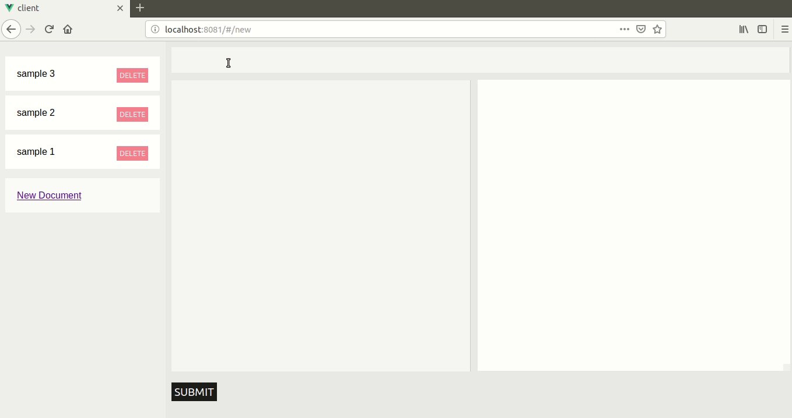

# MarkdownEditor

JavaScript application for saving, editing and view markdown documents.

## Tech stack

+ Server:
  + Node.js
  + express
  + mongoose
+ Client:
  + Vue.js
  + Vuex
  + [marked](https://github.com/markedjs/marked) (for compiling markdown documents)